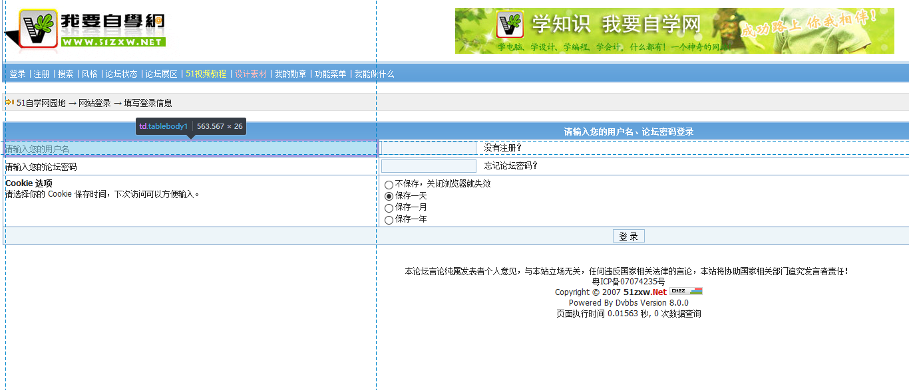

#表单优化
***
根据网页的无障碍性以及html标签语义化的上课要求
我在某一个网站上找到了这样一个“不合格的表单”

***
该网站的源代码如下：
`<input name="username" type="text"> &nbsp; <a href="reg.asp">没有注册？</a>
<input name="password" type="password"> &nbsp; <a href="lostpass.asp">忘记论坛密码？</a>`
>显然该表单并没有设计label标签而且在input框中也没有设计placeholder属性
这样的表单显然是不合格的同时此网页的表单布局采用的还是table布局在机动性上
显得很死板
> 附：网页原址<a>http://www.51zxw.net/bbs/login.asp